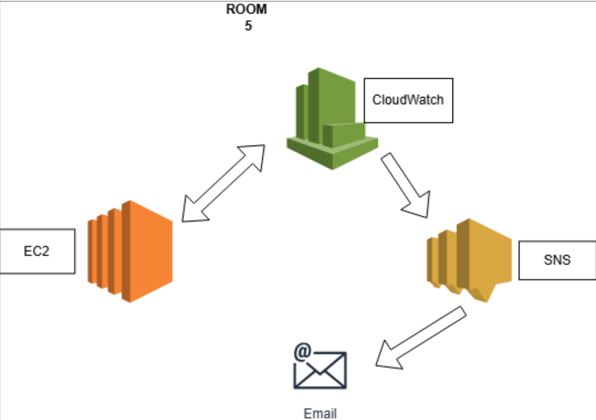
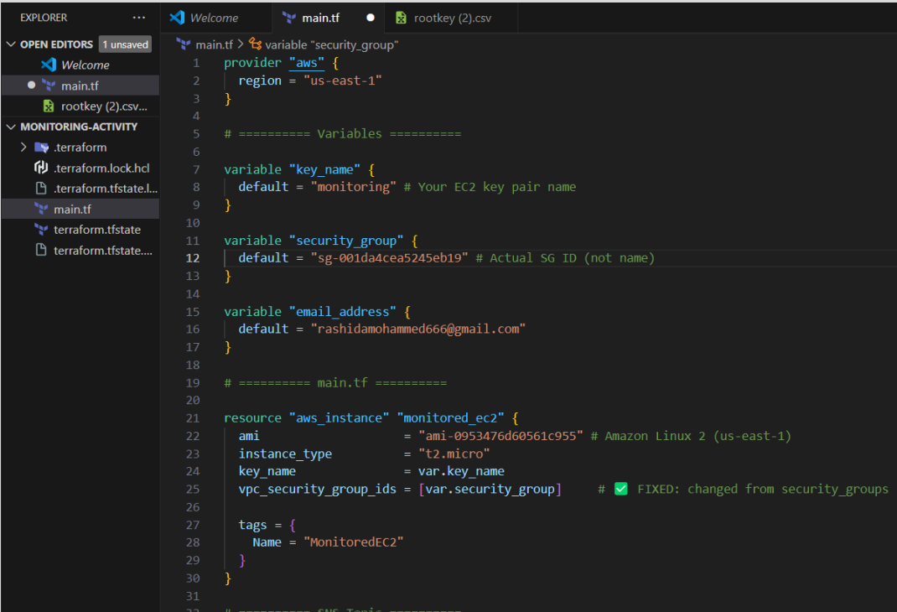
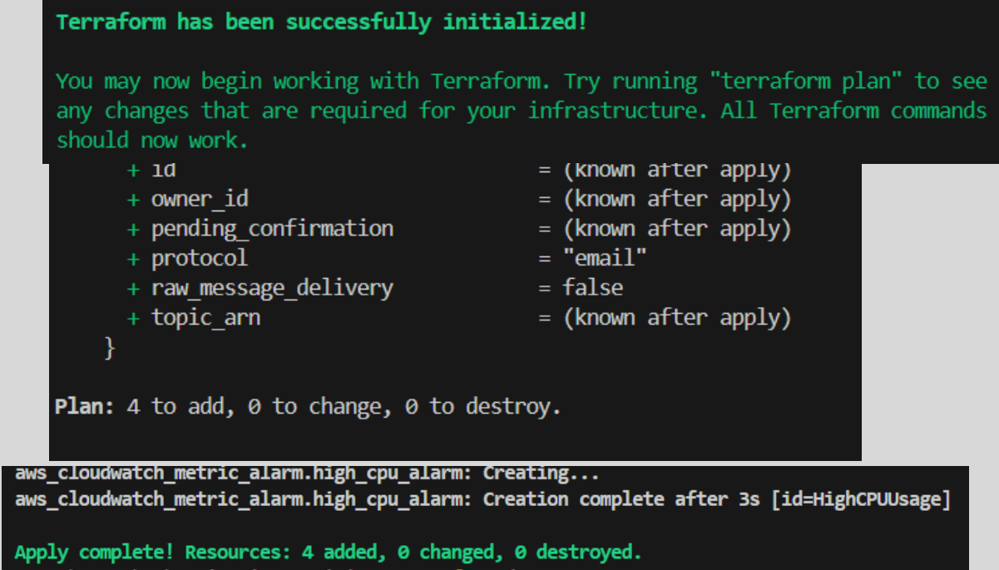
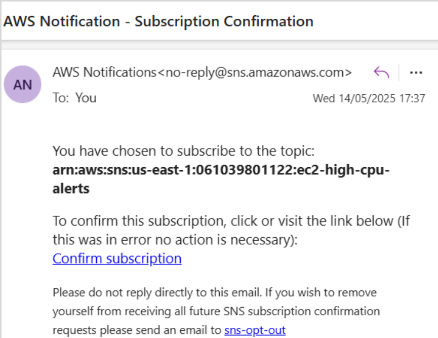
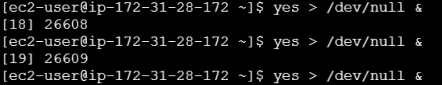
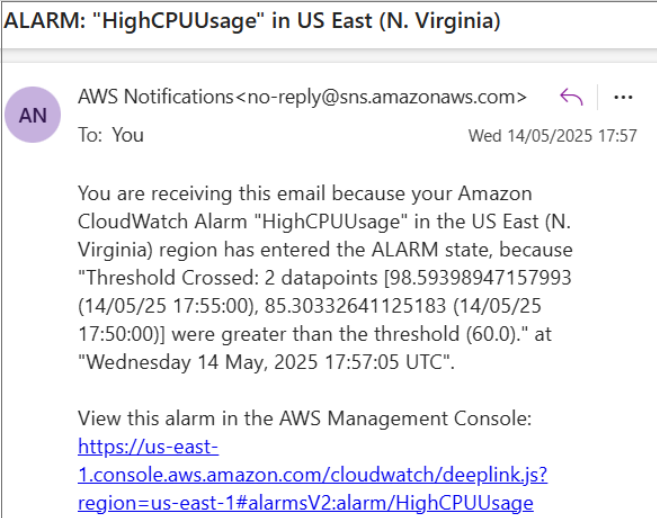
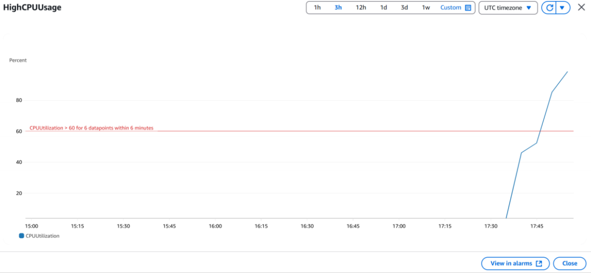
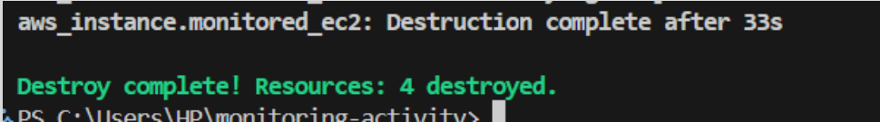

# EC2-Monitoring-and-Alerting-with-CloudWatch-SNS-and-Terraform

> A simple and scalable monitoring solution for an Amazon EC2 instance using Infrastructure as Code (IaC) with Terraform.

## 📁 Project Members

- Rashida Mohammed  
- Belinda Kafui Bansah  
- Robert Nyavor  
- Efia Birago  
- Emmanuel Ghartey  
- Eric Datsa

## 🧩 Architecture Overview

**Monitoring Flow:**  
`EC2 Instance → CloudWatch → SNS Topic → Email Notification`



## 🛠️ Infrastructure Components

| Component      | Description                                 |
|----------------|---------------------------------------------|
| EC2 Instance   | Amazon Linux 2 (t2.micro)                   |
| CloudWatch     | Monitors CPU usage, triggers alarms         |
| SNS            | Sends email notifications                   |
| Terraform      | Provisions and manages all AWS resources    |

## 🚀 Deployment Steps

### ✅ Prerequisites

- AWS account with permissions to use EC2, SNS, and CloudWatch
- Terraform installed locally
- Verified email address for SNS alerts

### 📄 Step 1: Create `main.tf`



Includes:

- EC2 Instance setup
- SNS Topic
- SNS Email Subscription
- CloudWatch Alarm for CPU usage

### 💻 Step 2: Deploy with Terraform



```bash
terraform init
terraform plan
terraform apply
```

### 📧 Step 3: Confirm Email Subscription

Check your inbox and verify the SNS email subscription.


### 🔧 Step 4: Simulate High CPU Load



SSH into the EC2 instance and run a CPU stress test (e.g., using `stress` tool).

## ✅ Testing & Results

- Alarm triggered to ALARM state
- Email alert received via SNS

- CloudWatch reflected increased CPU usage


## 📚 Learnings

- **CloudWatch Alarms** detect abnormal patterns like high CPU usage.
- **SNS** provides reliable, real-time notifications.
- **Terraform** ensures repeatable, version-controlled infrastructure deployment.
- Monitoring in AWS is essential for proactive system health management.

## 📈 Scaling for Production

- Use **CloudWatch Dashboards** for visual monitoring
- Create **Composite Alarms** for grouped alerts
- Automate responses using **Lambda** or **EventBridge**
- Centralize logs with **CloudWatch Logs**
- Utilize **AWS Systems Manager** for automation tasks
- Ensure environment consistency with **Terraform**

## 🔍 Additional Metrics to Monitor

- Memory Utilization  
- Disk Read/Write Operations  
- Network In/Out Traffic  

## 🧹 Cleanup

To destroy all resources and avoid extra charges:

```bash
terraform destroy
```



## ✅ Conclusion

This project showcases a fully automated EC2 monitoring and alerting solution using **AWS CloudWatch**, **SNS**, and **Terraform**. It lays a strong foundation for advanced infrastructure monitoring at scale.
